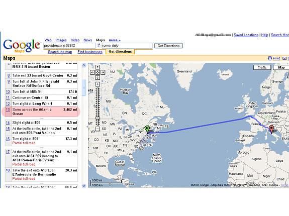

## The Software Society

### July 2014

Note:
1. Society Introduction

# Who am I

* Paul Sutherland
* Construction Surveyor at Black & Veatch
* Moved across to Application deployment
* Working on mobile app development
* Member of Software Society since its formation in 2011
* mail@paulsutherland.net

# WebRTC

* What it is
* How you can use it
* Technical challenges
* Browser woes

# Motivation

* Dive in to understand what the technology is
* Do a talk to bring everyone here up to speed
* Use it in my web projects
* Have fun with leading edge technology

## Let's Get in our Time Machine

### Back to 1994ish
<!-- .slide: data-background="img/time-machine.jpg" -->

##### When the web was young

##### When the web was a hypertext driven page centric design

##### Things were simple looking

##### Moving forward 1998

##### We were still dominated by page centric design

#### Then through the early to mid 2000s we became dynamic

#### The term "Web 2.0" was first used in January 1999 by Darcy DiNucci

"The Web we know now, which loads into a browser window in essentially static screenfuls, is only an embryo of the Web to come. The first glimmerings of Web 2.0 are beginning to appear, and we are just starting to see how that embryo might develop. The Web will be understood not as screenfuls of text and graphics but as a transport mechanism, the ether through which interactivity happens. It will [...] appear on your computer screen, [...] on your TV set [...] your car dashboard [...] your cell phone [...] hand-held game machines [...] maybe even your microwave oven".
<!-- .element: style="  text-align: left; font-style: italic; font-size: 20px; margin: 10px;" -->

###### https://en.wikipedia.org/wiki/Web_2.0

## Web 2.0

##### We we are interacting with the data without chasing links

##### We start to feed the machine

##### Giving birth to the Social web

## What Next?

# Welcome to the Real Time Web

<!-- .slide: data-background="img/real-time.jpg" -->

### Through the browser:

* File Sharing
* Live Chat
* Sensor Feeds
* Data Feeds
* Screen Sharing
* Gaming

### All Peer to Peer