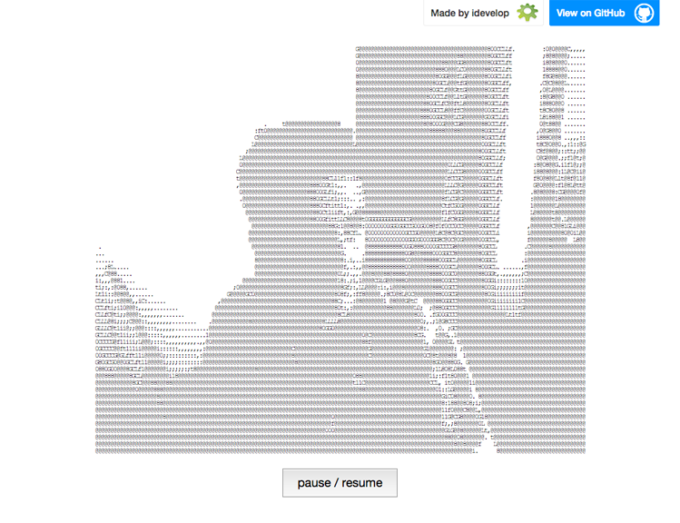

## The Software Society

### July 2014

Note:
1. Society Introduction

# Who am I

* Paul Sutherland
* Construction Surveyor at Black & Veatch
* Moved across to Application deployment
* Working on mobile app development
* Member of Software Society since its formation in 2011
* mail@paulsutherland.net

# WebRTC

* What it is
* How you can use it
* Technical challenges
* Browser woes

# Motivation

* Dive in to understand what the technology is
* Do a talk to bring everyone here up to speed
* Use it in my web projects
* Have fun with leading edge technology

## Let's Get in our Time Machine

### Back to 1994ish
<!-- .slide: data-background="img/time-machine.jpg" -->

##### When the web was young

##### When the web was a hypertext driven page centric design

##### Things were simple looking

##### Moving forward 1998

##### We were still dominated by page centric design

##### Early Amazon 2001

##### Early Amazon - no targeted ads!!

##### Even in 2003 it was still fairly static

#### Then through the early to mid 2000s we became dynamic

#### The term "Web 2.0" was first used in January 1999 by Darcy DiNucci

"The Web we know now, which loads into a browser window in essentially static screenfuls, is only an embryo of the Web to come. The first glimmerings of Web 2.0 are beginning to appear, and we are just starting to see how that embryo might develop. The Web will be understood not as screenfuls of text and graphics but as a transport mechanism, the ether through which interactivity happens. It will [...] appear on your computer screen, [...] on your TV set [...] your car dashboard [...] your cell phone [...] hand-held game machines [...] maybe even your microwave oven".
<!-- .element: style="  text-align: left; font-style: italic; font-size: 20px; margin: 10px;" -->

###### https://en.wikipedia.org/wiki/Web_2.0

## Web 2.0

##### We we are interacting with the data without chasing links

##### We start to feed the machine

##### Giving birth to the Social web

## What Next?

<!-- .slide: data-background="img/pill.jpg" style="background: none;" data-background-size="70%" -->

# Welcome to the Real Time Web

<!-- .slide: data-background="img/real-time.jpg" -->

### A world where through the browser you can:

* Share Files
* Live Chat
* Sensor Feeds
* Data Feeds
* Screen Sharing
* Gaming

### All Peer to Peer

### History
* Google purchase Global IP Solutions (GIPS) for $68m in 2010
* Google release WebRTC as a proposed standard in June 2011
* They have pushed the W3C and IETF to develop standards
* Ericsson Labs release a prototype

##### First Implementation

###### https://labs.ericsson.com/developer-community/blog/beyond-html5-peer-peer-conversational-video

### This is made possible using three APIs
* MediaStream
* RTCPeerConnection
* RTCDataChannel

### MediaStream
* Obtains the Audio and Video 
* Captures them as separate tracks
* Combines both the tracks to form a stream
* You interact via navigator.getUserMedia();

##### MediaStream

###### http://dev.w3.org/2011/webrtc/editor/getusermedia.html

##### getUserMedia()

###### http://dev.w3.org/2011/webrtc/editor/getusermedia.html

##### getUserMedia() Example

###### http://webcamtoy.com/app/

##### getUserMedia() Example

###### http://idevelop.ro/ascii-camera/

##### getUserMedia() Example

###### http://shinydemos.com/facekat/

### Constraints
* getUserMedia takes constraints
* determining the width and height of video
* Chrome allows screen capture (experimental)

### RTCPeerConnection
* Communicating with other Browsers
* Signal Processing
* Sets up the peer to peer communication
* Handles security

##### RTCPeerConnection

###### http://www.WebRTC.org

### RTCDataChannel
* Uses RTCPeerConnection to send Data
* This is in the form of JSON
* This can support gaming
* This can handle file transfers

### RTCDataChannel
* Uses a WebSocket style of API
* Low Latency 
* Sent as reliable or unreliable data

##### RTCDataChannel Example

###### https://www.sharefest.me/

### How do we find a Browser
* NATs and Firewalls cause problems
* Difficult to obtain a public IP

### STUN & TURN
* Stun can determine the public IP address of a browser
* Simple server which connects browsers peer to peer
* Google have released the source code for their STUN servers
* Images on Amazon available 
* stund package is available for Ubuntu

##### STUN server

###### http://www.html5rocks.com/

### TURN
* TURN Server is the back up
* Relays the connection is peer to peer fails
* Seamless in the background determining STUN or TURN

##### TURN server

###### http://www.html5rocks.com/

### Managing STUN and Turn

### Welcome ICE
* Managing the best connection rests with the ICE framework
* Figures out the best option for the call
* Utilises STUN as first resort

##### Security

###### http://io13webrtc.appspot.com/#55

### Browser Support
* Chrome 23
* Firefox 22
* Opera 18

### Mobile Support 
* Chrome 28
* Firefox 24
* Opera Mobile 12

### Apple
* Not supporting it
* They are very silent on it
* They would need to replace the VP8 codec with H.264
* Replace Opus voice codec with AAC-LD

### Microsoft
* Have an alternative called CU-RTC-Web
* Stands for: Customizable, Ubiquitous Real-Time Communication
* Looking at a lower level API 

<!-- .slide: data-background="img/webrtc-ready.png" style="background: none;" data-background-size="60%" -->

### Interoperability between browsers
* Firefox Beta post May 2013 
* Opera 20 
* Chrome 25 are interoperable

###### API Differences 
<!-- .element: style="font-weight:bold;" -->

|W3C Standard          | Chrome                   | Firefox                 |
|--------------------- | :-----------------------:| -----------------------:|
|getUserMedia          |  webkitGetUserMedia      | mozGetUserMedia         |
|RTCPeerConnection     |  webkitRTCPeerConnection | mozRTCPeerConnection    |
|RTCSessionDescription |  RTCSessionDescription   | mozRTCSessionDescription|
|RTCIceCandidate       |  RTCIceCandidate         | mozRTCIceCandidate      |
<!-- .element: style="font-size:20px; margin:0 auto;" -->

<!-- .slide: data-background="img/chrome-flags.png" style="background: none;" data-background-size="70%" -->

<!-- .slide: data-background="img/firefox-about.png" style="background: none;" data-background-size="60%" -->

### Outside the Browser
* sipML5 open source JavaScript SIP client
* Phono open source JavaScript phone API
* Zingaya embeddable phone widget

### Demo
http://zebibyte.co.uk

### But Wait
* Due to Apache woes it is not working seamlessly
* Needs Apache 2.4 to proxy to web sockets
* Proxy for social media login is flaky

### So for now hit the node server direct
http://78.129.251.242:7777